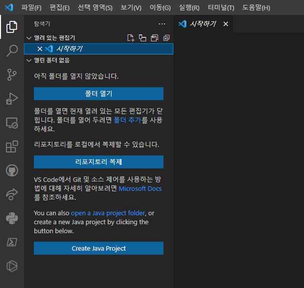

# 에디터

마크다운은 텍스트 파일입니다. 메모장으로 작성하는 그 텍스트 파일을 말하는 것이 맞습니다. 하지만, 메모장은 하나의 프로젝트를 진행하기에는 기능이 너무 부실합니다. 메모장보다 기능이 많은 다른 텍스트 에디터를 사용하는 것이 좋습니다.

우리에게 쓰기 좋은 텍스트 에디터는, 마크다운 파일의 구조를 한 눈에 알아보기 쉽게 보여주고, 지정한 폴더의 구조를 직관적으로 보여주며, 여러 개의 텍스트 파일을 한 창에 여러 탭으로 열 수 있는 프로그램입니다. 이러한 용도로 좋은 텍스트 에디터로는 [Sublime Text](https://www.sublimetext.com/), [notepad++](https://notepad-plus-plus.org/) 등이 있는데, 현재 가장 많은 사람들에게 사용되고 있는 텍스트 에디터는 [Visual Studio Code](https://code.visualstudio.com/)입니다. 줄여서 VSC라고도 합니다.

앞으로 이 책에서는 VSC를 사용해서 책을 만들 거지만, 다른 텍스트 에디터도 사용이 가능합니다. 추천하진 않지만 메모장도 사용이 가능은 합니다. 결국 같은 텍스트 에디터이고 사용하기만 편리하면 어느 것을 사용해도 상관 없으나, 이 책에서 설명하는 것과 조금 내용이 다를 수 있음은 감안해주시기 바랍니다.

**만약 이미 사용하고 있는 텍스트 에디터가 있거나, 이미 VSC가 설치되어 있는 사람들은 Better TOML 확장만 설치하고 이 챕터를 스킵해주세요.** 아래에선 VSC를 설치하고 간략하게 사용하는 방법을 정리합니다.

## 설치

[Visual Studio Code](https://code.visualstudio.com/) 공식 사이트에 들어가 다운로드 버튼을 눌러서 설치하면 끝입니다.

## 기본 사용 방법

VSC를 처음 실행하면 아래와 같은 창이 나올 겁니다.

색이 조금 다를 수 있고, 왼쪽 사이드바에 버튼이 더 적겠지만 상관 없습니다. 만약 언어를 바꾸고 싶다면 [이 글](https://www.lainyzine.com/ko/article/how-to-change-language-setting-in-visual-studio-code/)을 참고해서 바꿔주세요.

그러면, 왼쪽 바의 가장 위쪽 종이 2장이 그려진 버튼을 클릭해봅시다.

그러면 폴더를 여는 버튼이 나옵니다. 이 버튼을 클릭해서 나중에 우리의 책이 저장되어 있는 폴더를 열어서 거기서 작업을 할 겁니다.

## 확장 프로그램 설치

VSC의 가장 큰 장점 중 하나로, 커뮤니티가 매우 크게 활성화되어 있어 유용한 확장 프로그램이 매우 많습니다. 확장 프로그램을 적절히 설치하면 VSC를 한결 편리하게 사용할 수 있습니다.

확장 프로그램은 사이드바의 작은 정사각형 4개가 그려진 버튼을 클릭해서 관리할 수 있습니다. 아래 그림의 왼쪽 사이드바에서 강조된 버튼입니다.

클릭하시면 상단에 *마켓플레이스에서 확장 검색*이라고 나오면서 확장 프로그램을 검색할 수 있는 창이 나옵니다. 이 창에 다음 확장프로그램을 검색해서 설치해줍시다.

- Better TOML: mdBook에 포함된 toml 파일을 관리하기 편하게 해줍니다.
- Prettier (선택): 작성한 마크다운 파일을 보기 좋게 정리해줍니다.
- Markdown All in One (선택): 마크다운 파일을 작성할 때 편리한 기능을 제공해줍니다만, mdBook 작성시엔 별 상관이 없습니다.
- GlassIt-VSC (선택): VSC 화면을 반투명하게 해줍니다. 모니터가 하나밖에 없거나 모니터가 작을 때, VSC 화면 뒤편으로 작성하고 있는 책을 실시간으로 볼 수 있게 해줍니다.

### Prettier 사용 설정

VSC에서 Ctrl+Shift+P를 누르고 '설정'을 검색하면 `기본 설정: 설정 열기(UI)` 항목이 있을 겁니다. 그 항목을 방향키와 엔터로 선택하면 창이 하나 열립니다. 상단에 있는 검색창에 아래 두 개를 검색해서 다음과 같이 설정해주세요.

- format on save 검색 -> Format on save 체크
- default formatter 검색 -> Default Formatter를 None에서 Prettier로 변경

이로써 파일이 저장될 때마다 파일이 깔끔하게 정리되며, 이는 Prettier 확장 프로그램을 사용해서 이루어집니다.

## 기타 사용방법

저희는 후에 직접 책을 만들어보면서 필요한 기능을 자연스럽게 배울 거지만, 프로그램 사용법을 더 깊이 알고 싶으시다면 인터넷에 튜토리얼이 널려 있으므로 구글링하시면 됩니다. 'visual studio code 사용법'을 검색하면 튜토리얼이 쏟아져 나옵니다. 그래도 잘 모르시겠다면 [이 글](https://demun.github.io/vscode-tutorial/)을 보시면 됩니다.

---

이로써 여러분의 첫 마크다운 책을 만들기 위한 준비가 완료되었습니다! 다음 장에서부터 저희만의 책을 직접 만들어보면서 mdBook을 사용하는 방법을 익혀봅시다.
