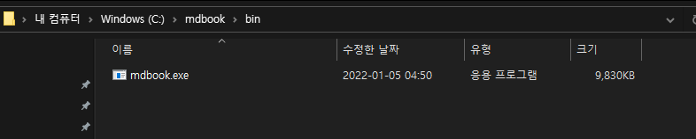
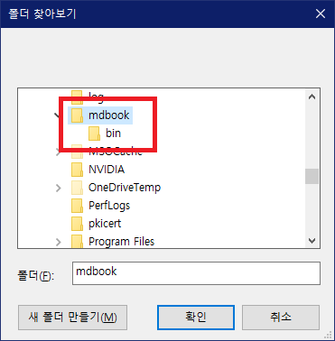

# mdBook 설치

mdBook을 설치하는 방법은 [공식 가이드](https://rust-lang.github.io/mdBook/guide/installation.html)에 나와있긴 하지만, 영어나 컴퓨터를 잘 모르는 사람이 보면 머리가 아플 만한 글입니다. 따라서, 이 글에서는 Windows 운영체제에서 mdBook을 설치하는 방법을 알려드리겠습니다.

컴퓨터에 `cargo`가 설치되어 있다면 터미널을 키고 `cargo install mdbook`을 입력하면 설치가 끝납니다. 만약 이게 무슨 의미인지 모르시겠다면 설치되어 있지 않은 것이니 아래 글을 읽으시면 됩니다.

## mdBook 프로그램 다운로드

[mdBook 릴리즈](https://github.com/rust-lang/mdBook/releases)에 들어가서 가장 최신 버전의 설치파일을 다운받으시면 됩니다. 윈도우를 사용하신다면 `mdbook-(버전명)-x86_64-pc-windows-msvc.zip`을 다운받으시면 됩니다.

다운받으신 압축파일을 열어보면 위와 같이 `mdBook.exe`라는 파일이 있을 겁니다. 이제, 내 컴퓨터를 열고 C 드라이브로 가셔서 `mdbook`이라는 이름의 폴더를 만들어주세요. 그리고, 그 폴더 안에 `bin`이라는 폴더를 만들어주세요. 그 bin 폴더 안에 압축파일에 들어 있던 `mdBook.exe`를 아래와 같이 넣어주세요.

## 환경변수(PATH) 설정

이 문단의 이미지는 [이 글](https://rootblog.tistory.com/206)에서 가져왔습니다.

이제 *환경변수*라는 것을 설정할 겁니다. 환경변수를 설정하면, cmd창에서 mdBook을 어디서든 편리하게 실행할 수 있습니다. 컴퓨터 좌측 하단 시작 버튼을 눌러 `고급 시스템 설정`을 검색합니다.

`고급 시스템 설정 보기`를 클릭해 실행하면 아래와 같은 창이 나옵니다.

하단의 `환경 변수`를 클릭하면 아래와 같은 창이 나옵니다. 시스템 변수에서 변수명이 `PATH`인 항목을 찾아 편집을 클릭합니다.

그러면 아래와 같은 환경 변수 편집 창이 나옵니다. 우측의 `찾아보기`를 클릭합니다.

그러면 아래와 같이 폴더를 선택할 수 있는 창이 나옵니다. 아까 만들었던 `mdbook` 폴더를 선택해줍니다. 그 안에 있는 `bin`이 아닙니다.

그리고 모든 창에 확인을 눌러줘서 나오면 됩니다. 그리고 시작 버튼을 눌러 cmd를 입력해서 `명령 프롬프트`를 실행하고, `mdbook`을 입력하고 엔터를 누릅니다.

이때 위와 같이 무슨 문구가 막 나오면 성공입니다! 이제 여러분은 mdBook으로 책을 만들 준비가 되었습니다.

---

이로써 mdBook 설치는 완료되었지만, 아직 한 단계가 더 남아있습니다. 마크다운 파일을 편집할 때 메모장으로 편집하면 답답해 죽습니다. 더 편리한 도구가 필요합니다.
