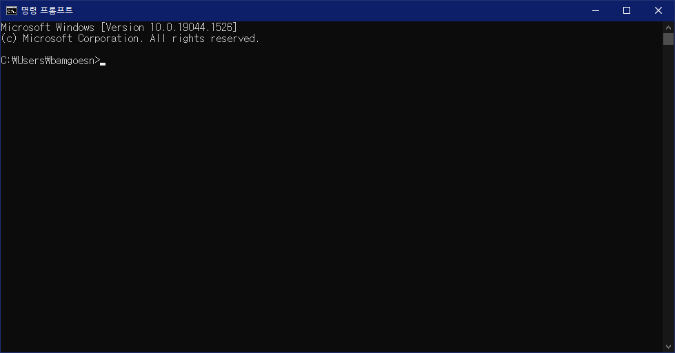
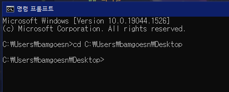
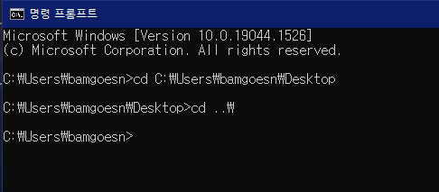
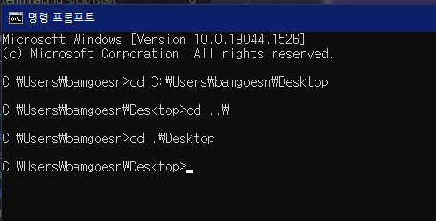
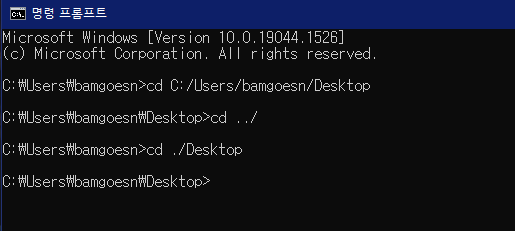
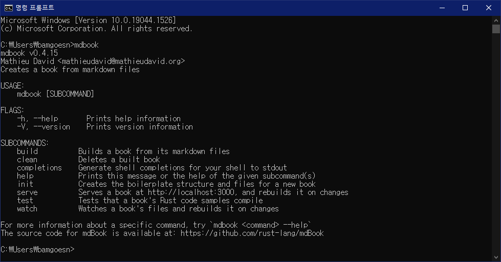

# 터미널이란

이제 곧 본격적인 튜토리얼에 들어갈 건데, 그 전에 **터미널**이 무엇인지 알아야 합니다. 이는, mdBook이 **커맨드 라인 인터페이스(CLI)** 프로그램이기 때문에, 터미널이라는 것을 사용해서 mdBook을 다루게 될 것이기 때문입니다.

터미널이 무엇인지 이미 알고 계시다면 이 항목은 건너뛰시면 됩니다.

## 터미널

**터미널**은 컴퓨터를 커맨드를 입력함으로써 사용할 수 있게 해주는 프로그램입니다. **CMD**가 대표적인 Windows의 터미널입니다. 시작 버튼을 눌러 `cmd`를 입력해 `명령 프롬프트`를 실행해봅시다.

  

CMD를 처음 실행하면 위와 같은 창이 나옵니다. `C:\Users\bamgoesn`라는 문구 뒤에 글자를 입력할 수 있는 커서가 깜빡이는 것을 확인할 수 있는데, 저 문구는 현재 터미널이 가리키고 있는 폴더의 위치입니다. 즉, 현재 터미널이 C드라이브의 `Users` 폴더의 `bamgoesn` 폴더를 가리키고 있는 것입니다.

터미널은 가리키고 있는 폴더에 대해 커맨드를 입력함으로써 동작하는 프로그램입니다. 감을 잡게 해드리기 위해 기본적인 커맨드를 입력해봅시다.

### 폴더 이동

터미널을 키자마자 나온 창에서 `cd (가리키고 있는 폴더)\Desktop`을 입력해봅시다.

  

가리키고 있는 폴더가 `C:\Users\bamgoesn\Desktop`으로 바뀌었습니다. 이 디렉토리는 바탕화면입니다. 이와 같이 `cd`는 가리키고 있는 디렉토리를 변경하는 커맨드입니다. cd 뒤에 이동할 디렉토리를 입력함으로써 해당 디렉토리를 가리키는 상태로 CMD를 조작할 수 있습니다.

### 상대 경로

앞서 폴더 이름 전체를 입력함으로써 디렉토리를 이동했는데, 아무리 봐도 너무 불편합니다. 그럼 한번 `cd ..\`를 입력해봅시다.

  

부모 폴더로 돌아왔습니다. `..\`는 부모 폴더를 의미합니다. 그러면 이번엔 `cd .\Desktop`를 입력해봅시다.

  

그랬더니 지금 가리키고 있던 디렉토리에 있는 `Desktop` 폴더를 가리킵니다. 이는 `..\`가 현재 있는 폴더를 의미하기 때문입니다. `..\`와 `.\`와 같이 현재 가리키는 디렉토리를 기준으로 위치가 결정되는 경로를 **상대 경로**라고 부릅니다. 폴더와 폴더 사이를 이동할 때엔 이 상대 경로를 더 자주 이용하게 됩니다.

한편, `\` 대신 `/`를 사용해도 동일하게 동작합니다. 아래는 지금까지 한 것들을 `/`를 사용해 다시 한 것입니다.

  

그리고, 폴더 이름을 다 입력하지 않고 `Tab` 키를 누르면 폴더 이름이 자동완성됩니다.

## 커맨드 라인 인터페이스 (Command Line Interface)

**커맨드 라인 인터페이스(CLI)**는 터미널에서 커맨드 라인으로 실행하는 프로그램을 의미합니다. 일반적인 프로그램은 아이콘을 더블클릭하면 창이 열리고, 이런저런 버튼을 클릭하면서 조작하게 되는데, 이러한 프로그램을 그래픽 유저 인터페이스(Graphic User Interface, GUI) 프로그램이라고 부릅니다. 반면 CLI 프로그램은 GUI가 없이 터미널로만 이용이 가능하죠. mdBook은 이러한 CLI 프로그램의 하나이기 때문에, mdBook을 사용하려면 기초적인 터미널 사용법을 알아야 합니다.

cmd에 `mdbook`을 입력해봅시다. 커맨드 맨 앞에 프로그램의 이름이 오면 해당 프로그램을 실행한다는 의미가 됩니다.

  

mdbook을 실행하면 mdbook을 이용하는 방법이 위와 같이 표시됩니다. `USAGE` 항목을 보니 커맨드에서 `mdbook` 뒤에 무언가를 더 붙여서 프로그램을 사용한다는 모양입니다. 다음 장에선 구체적으로 mdbook을 어떻게 사용하는지를 직접 책을 만들어보면서 배워봅시다.
