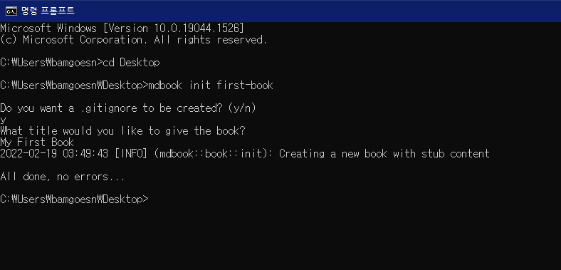
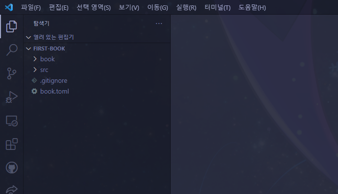

# 새로운 책 만들기

이제 mdBook을 본격적으로 사용해보면서 저희만의 작은 책을 만들어봅시다! 우선 CMD를 키고 `cd Desktop`을 입력해 바탕화면으로 이동한 후, `mdbook init first-book`을 입력해봅시다. 그런 다음 `y`와 `My First Book`을 입력해줍시다.

<p align="center">  </p>

그리고 바탕화면을 확인해보면 `first-book`이라는 폴더가 생성된 것을 확인할 수 있습니다. VSC를 키고, `파일 -> 폴더 열기`를 눌러 `first-book` 폴더를 열어봅시다.

<p align="center">  </p>

그러면 해당 폴더가 위 그림과 같은 구조로 되어 있음을 확인할 수 있습니다. 각 요소가 무슨 역할을 하는지 알아봅시다.

- src: 책의 내용이 저장된 폴더.
  - chapter_1.md: 기본으로 만들어진 마크다운 파일. 이 파일과 같은 방법으로 책에 포함될 모든 문서를 만들게 됩니다.
  - SUMMARY.md: 책의 단원 구성을 담은 마크다운 파일.
- book: 웹에 표시하기 위해 변환된 책 파일을 담은 폴더. mdbook 프로그램으로 자동생성되는 부분으로 건드릴 필요 없습니다.
- book.toml: 책의 속성을 저장하는 파일.

그럼 살펴봐야 할 파일의 내용을 확인해봅시다.

## book.toml

`book.toml` 파일은 책의 속성을 기록합니다. 현재 내용은 아래와 같은 형식일 겁니다.

```toml
[book]
language = "en"
multilingual = false
src = "src"
title = "My First Book"
```

`language`는 이 책의 언어를 표시합니다. 우리 책은 한국어로 적힐 예정이니 ko로 바꿔줘도 되지만, 이는 웹 검색 노출과 가장 큰 관련이 있는 거라 가만히 둬도 됩니다.

`multilingual`는 다국어를 지원하는 사이트인지 아닌지를 표기하는 항목입니다. 아예 지워버려도 됩니다.

`src`는 책의 내용이 어느 폴더에 들어있는지를 표시합니다. 전술했듯이 책의 내용은 `src` 폴더 안에 들어 있으므로 `src = "src"`가 올바른 값입니다.

`title`은 책의 제목입니다. 사이트 상단에 제목으로 항시 표시됩니다. 이는 후에 확인해볼 겁니다.

### 수식 지원 추가

한편 마크다운은 기본적으로 수식을 지원하지 않습니다. 대신, mdBook에 수식을 지원하는 플러그인을 간단히 추가할 수 있습니다. `book.toml` 파일 밑에 아래 내용을 추가해주세요.

```toml
[output.html]
mathjax-support = true
```

그러면 이 책에서 수식을 사용할 수 있게 됩니다. 구체적인 사용 방법은 곧 알아볼 겁니다.

최종적으로 `book.toml`의 내용은 아래와 같아져야 합니다.

```toml
[book]
language = "ko"
src = "src"
title = "My First Book"

[output.html]
mathjax-support = true
```

`book.toml`은 이대로 놓고 저장해둡시다. 이 파일은 제목을 바꿀 때 이외에는 건드릴 일이 없습니다.
